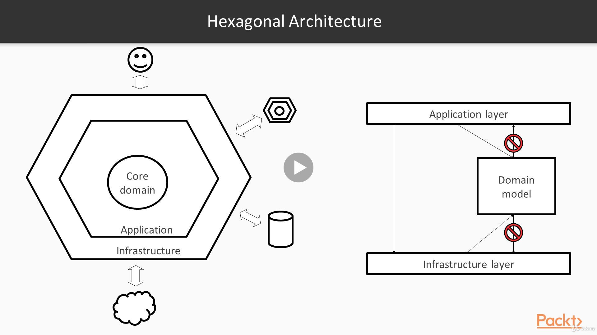

# Microservices Architecture

## Reference Documentation

This review of concepts is a summary for the section dealing with Design Practices and Tips of Dimos Raptis's course on Udemy.

This is based primarily on the reference below:

* [Microservices Architecture](https://www.udemy.com/course/microservices-architecture/)

## Features

These are the key features that we'll cover in this review:

- Microservices Design and Boundaries

- Operations in a Microservices Environment

- Polyglot Programming and Persistence

- Moving from a Monolith to Microservices

- Considerations for a Microservices Architecture

# Design Practices and Tips

In this section, we'll present some general practices for designing a microservices architecture and provide some tips around related topics, such as operating such an architecture or migrating from a monolithic architecture.

We'll cover five parts. We'll start by discussing how we should approach the design of a microservices architecture, what's the importance of boundaries, and how we can identify them successfully.

We will then look at several practices and tips that can help us operate a microservices architecture as efficiently as possible. 

In the next topic, we will explore the concept of Polyglot Programming and Persistence, why it is useful, and try to give several practical examples.

In the fourth part, we will tackle the problem of migrating from a monolith to a microservices architecture, what are the possible pitfalls and how we can avoid them.

Lastly, we'll conclude by taking a step back and reflecting on fact that a microservices architecture, like everything else, has its own drawbacks, and might not be appropriate for some cases.

## Microservices Design and Boundaries

In this first part, we'll look at how we should design a microservices architecture and what is the role of boundaries on this design.

## Isolation and Independence

First of all, let's remember what is the basic value proposition of a microservices architecture.

On the one hand, by moving to a microservices architecture, we are able to provide isolation and independence between teams, so that they can deliver software faster.

This isolation forces teams to think more carefully about their APIs and the way they communicate with other services, because they need to be as decoupled as possible.

On the other hand, we are capable of aligning the business direction with a technical structure. This means that ideally each team should not just own some systems, but but they should own systems that belong to a specific business domain. This will allow the team to be more impactful, since they can define business KPI's that they would try to improve, thus having concrete and measurable impact.

A great mechanism for achieving these goals is by defining specific boundaries between services and teams.

The tricky part is finding the right way to identify these boundaries.

### How to Identify the Right Boundaries

Now, if we recall the section about Domain Driven Design, we'll remember that we talked about a concept called Bounded Contexts.

So, the most important tool for identifying these boundaries is first identifying deeply what our business is doing, outlining the Bounded Contexts, and then mapping these to separate systems or services.

However, there are also some additional guidelines that can help us identify flaws in the structure of a microservices architecture.

We'll go through some of these guidelines here.

### Coupling and Cohesion

As we have seen in the past, two other concepts that can help us drive the design of our architecture are Coupling and Cohesion.

Following the principle of high Cohesion, we need to make sure that the boundary of each microservice is large enough so that the microservice is tackling a large enough business problem.

The anti-pattern here is referred to as nano-services, implying that their size is too small to provide enough value. For instance, let's say various services need information around the customer profile. Creating multiple services for different attributes of the profile, such as one service providing the contact details and another one providing the photo of the customer might reduce the Cohesion of our services significantly.

Following the Loose Coupling principle, we need to make sure that each service is dependent to the least possible amount of services.

Ideally, our architecture should look something like this diagram, where each problem is solved hierarchically by composing services recursively, where the number of connections is balanced across services and there is no service with an extremely large number of connections.

Of course, having a circular dependency in our architecture is a big red flag and usually an indicator of a deeper problem in the way we split these Bounded Contexts.

Coupling and Cohesion, by Dimos Raptis, [Udemy](https://www.udemy.com/course/microservices-architecture/).

### Data Ownership

A second guideline for designing our architecture is Data Ownership. 

By that, we mean that, ideally, the system that is the authoritative source of a piece of data should be responsible for the full lifecycle of that data.

For example, when building a catalog, the single system should be responsible both for the reads and the writes to the Catalog, instead of having a separate system writing to this data store.

This will make it easier to guarantee that business constraints that apply to the data are always satisfied.

If we pay attention, we'll probably notice that we used the term system instead of service, because what matters in this rule is the team that owns the software. 

To give an example, there are some cases where for performance reasons, writes are applied to a separate service, and eventually propagate to the data store that will be the authoritative source. What matters in that case is that both of these services are part of the same system which is ideally owned by the same team.

Data Ownership, by Dimos Raptis, [Udemy](https://www.udemy.com/course/microservices-architecture/).

### Transaction Semantics

The third guideline we could use is the transactional semantics required for a specific operation.

If we have three services with three separate data stores, but a business operation needs to be performed across all databases as a single atomic transaction, then that's really hard in this setup, because of the fact that distributed transactions are a hard thing to achieve.

However, an architecture where all that data are kept in a single database that supports transactions and fronted by a single service might make things a lot easier.

That said, we need to be careful and try to understand whether a business operation actually requires transactions or we could live with a system that is eventually consistent.

Transaction Semantics, by Dimos Raptis, [Udemy](https://www.udemy.com/course/microservices-architecture/).

## Anti-Patterns

Now that we've seen some basic guidelines, we'll look into some practical examples.

We should keep in mind that these are real life examples, but they've been made more generic and abstract, so that we can understand what is the anti-pattern behind them: understand why we should avoid it and how some of the presented guidelines can protect us against it.

### Pass-Through Data Between Services

In this example, we have three services. Service A is the highest level service, which calls Service B. The coloured boxes inside Service A and B illustrate the fact that they perform different business functionalities.

However, both services need to call Service C to retrieve some data.

Pass-Through Data Between Services / Scenario 1, by Dimos Raptis, [Udemy](https://www.udemy.com/course/microservices-architecture/).

A practical problem that might come up here is that Service C might not be that efficient, meaning that we can cannot call it from both services, otherwise, our overall system will be very slow. 

A quick countermeasure could be the following here: since the data are retrieved already in Service A, we would just pass it through to Service B when we make the remote call.

In this way, Service B would not need to call Service C anymore.

This is a huge violation of encapsulation, and couples these two services very strongly, since Service A now has knowledge about the internals of Service B.

Pass-Through Data Between Services / Scenario 2, by Dimos Raptis, [Udemy](https://www.udemy.com/course/microservices-architecture/).

Of course, there are many technical ways to mitigate this issue.

However, what we care about here is the structure of our architecture. This design smell might be an indication of a deeper problem.

Given the fact that both the blue and the green funtionality required data from Service C, it is highly possible that both of these operations belong in the same Context.

As a result, by moving the blue functionality from Service A to Service B, we can remove the coupling between the services by not passing through data anymore. Doing that, we also increase the Cohesion of Service B, since now related functionality is located in the same service.

Pass-Through Data Between Services / Scenario 3, by Dimos Raptis, [Udemy](https://www.udemy.com/course/microservices-architecture/).

### Features Requiring Cascading Changes

This is a more classical example in the microservices architecture.

We'll assume that our team owns the service colored in blue at the bottom.

We are planning to release a new feature and we realize that in order for that feature to reach our customers, we need to make some changes to our upstream service so that it can make use of the new feature.

In the worst case, that pattern goes on and we need to change their upstream as well, so that they can also consume the new feature.

Thinking about that, we can say that this made us less independent, since improving our service was not enough.

Despite the claims that a microservices architecture makes us more independent and agile, this problem is usually caused by the fact that the communication between services is strongly coupled, requiring us to update the APIs between the services for any change.

In this case, we could benefit by making our APIs more generic and loosely coupled.

As an example, assuming that our service is providing different payment methods, we could structure our API so that there is a common model for all our payment systems so that introducing a new payment system can be automatically consumed by the upstream systems and presented to the customers.

Of course, depending on technical details and limitations of third party systems, this might not always be feasible, but we should strive for it.

Features requiring Cascading Changes, by Dimos Raptis, [Udemy](https://www.udemy.com/course/microservices-architecture/).

## Internal Design

So far, we looked at what we can do to split responsibilities correctly between services so that our microservices architecture is nicely structured, allowing our development teams to work efficiently and our systems to be performing.

After achieving that, we still have to be careful, so that we structure appropriately each service internally, so that the code is just maintainable as possible.

A very common Design Pattern for services is the Hexagonal Architecture. 

This architecture proposes separating our service into different layers, where each layer has a different responsibility.

The first and most important part is our Domain model, which contains all the components that model our Business Domain.

These components encapsulate some core data of our Business Domain along with the necessary business logic.

The next layer is the Application Layer, which contains components required for our application to function, such as framework related components or components that are responsible for orchestrating the use of some components from the Core Domain.

Lastly, there is the Infrastructure Layer, that contains low level components, that solve infrastructure problems, such as connecting to a database, calling another service, communicating with third party systems, or even receiving data from humans.

These layers allow us to distribute responsibilities and make our code easier to understand.

However, ideally the way these layers collaborate, should follow specific rules, if we want them to be easy to modify and understand.

More specifically, the application layer will depend on the infrastructure layer in order to fetch data from dependencies, and it will also depend on the Core Model, which will provide all the business logic.

In some cases, the infrastructure layer might depend on the Core Model. To understand why, we can think of the example we gave on previous sections about the Dependency Inversion principle. Following that principle, we would have defined our Core Model and the Infrastructure Layer would just provide the implementation of the interfaces exposed by our Core Model. However, sometimes this is not possible and the Application Layer is responsible for transforming the data returned from the Infrastructure Layer to the data modeled by our Core Domain model.

However, what is really important to call out here is that the Core Domain should not depend on anything.

The way we model our Business Domain should not be affected at all by the Application Framework or the kind of database we'll decide to use.

Hexagonal Architecture, by Dimos Raptis, [Udemy](https://www.udemy.com/course/microservices-architecture/).

# Operations in a Microservices Environment

In this section, we'll look at how we can operate our microservices architecture, discussing the major operational characteristics of this architecture, and presenting some best practices.

## DevOps

As we've already seen, adopting DevOps is critical for success in a microservices architecture.

Microservices architectures introduce much more operation than the classical monolithical systems, since whatever we needed to do only once for our monolith, we need to do now for every single one of our hundreds or thousands of services.

As a result, involving software enginners in the operations part and pursuing automation can be extremely useful.

## Core Principles of DevOps

Let's have a look at the main principles of DevOps we should keep in mind when moving to a microservices architecture.

        - CI/CD

        - A culture, not a role

            - Collaboration

            - Sense of ownership

        - Various models:

            - On-call developers

            - Site Reliability Engineering (SRE)

The first and most crucial part is having a Continuous Integration and Deployment pipeline for all our microservices.

This will make sure our developers will stop wasting time in manual tasks, such as building and deploying software, and they could invest that time in developing new software.

Another very important thing that many people ignore is that DevOps is supposed to be a culture and not a new role.

The core idea of DevOps is that having zero communication between developers and operators is unacceptable, since it creates silos and the culture of blame between these two groups.

What we need is a spirit of collaboration between these two groups, so that they help each other and make their work easier.

This will also develop a sense of ownership in both teams, since developers will be accountable for how their software is deployed and operated and will thus develop it in a way that will make these aspects easier.

Given all of that, it's not necessary to create a new role for DevOps engineers. We can just cross-train our developers and operators, so that they can communicate and work together efficiently.

Looking at big companies that have adopted a microservices architecture, we can identify two main models of execution of the DevOps principles.

The first model is one where companies do not have a lot of operators, since developers are responsible for the operations as well, being on call for potential incidents with their systems.

The biggest benefit of this model is that enginners tend to write much better software when they are responsible for operating it and might get paid outside work hours.

Of course many enginners don't like this model for obvious reasons.

So a company might face some difficulties hiring when adopting this model.

It should be made clear though that when applied correctly, this model has almost no implication to the work life balance of software developers.

The second model is one where companies have a separate team, usually called SRE team (Site Reliability Engineering), which is responsible for operating the production systems and also automate processes and potentially write software that can help in this direction.

This model can be a good fit for companies where there is a set of internal technologies and platforms that people use to build their services, so SRE teams can be responsible for these platforms, which will be the biggest part of operational workflow for the company.

The benefit of this model is that these teams are usually highly specialized in this field, and can optimize and automate the systems to a great extent.

A company that has adopted this model with great success is Google, which has also published a book about how this model can be applied.

## Observability

As we've discussed before, in a microservices environment, it's really important to make our systems observable so that we can understand what they're doing at any moment regardless of the complexity of our architecture.

## Logging x Monitoring

Of course the two core mechanisms for making a system observable is logging and monitoring.

### Logging 

Logging can help us understand what's going on in great detail even looking at individual requests, while monitoring can help us understand the state of our systems at a higher level.

Regarding logging, it is very important to have a centralized storage for the logging of all our services so that searching for a specific thing is as easy as possible. 

Having a centralized store for logs could also allow teams to search for logs of dependent services, thus reducing communication overhead.

Another important point for logging is implementing correlation IDs, as we discussed previously, so that we can link requests between services.

### Monitoring

On the other hand, monitoring is very helpful for understanding the state of our systems, but there is an inherent risk here. 

Monitoring our systems without alarming on our metrics can let to situations where people never examine the metrics of a system, thus loosing track of its behavior and potential regressions on performance.

So it's very important to combine monitoring with alarming to take full advantage of it.

### Alarming Practices

We'll now have a quick look at some basic alarming practices. 

The first thing we need to do for our service is defining our Service-Level Objectives explicitly.

        - Make our Service-Level Objectives (SLOs) explicit and alarm aggressively on them.

            - Operational (SLOs)

            - Business (KPIs)

            - Alarm on SLOs of dependencies

            - Secondary alarms for non-critical issues

After that's done, we can instrument our system appropriately so that we can alarm when our system violates these SLOs. Alarming aggressively is a good practice which means that alarms are set to a level slightly lower than our SLOs so that we're notified before the service breaches the threshold.

As we discussed before, there are two kinds of of SLOs we'll need to take care of: the Operational ones that might be around latency throughput or the number of errors and the Business ones, which might also be called Key Performance Indicators (KPIs).

Whether we will be alarming on both kinds or only the operational ones is our decision.

What is common as a practice is alarming on the Operational ones, so that developers can quickly handle potential incidents and then reviewing the business KPI in a weekly or monthly meetings in order to understand what can be done to improve them.

Another practice that is sometimes followed but not always is also alarming on the SLOs of our dependencies.

Some people might argue that this will just become noise, since we only care about our service SLO's, while other people argue that it might help mitigate incidents earlier by having an early notice that something is probably going to happen.

This practice is usually highly correlated with a culture of an organization, for example, in companies where people demonstrate a high sense of ownership, teams don't tend to alarm on dependencies, since they know other teams will be fully responsible for prevention and mitigation of any incident on their side.

Besides the major alarms on the SLOs, teams sometimes also have secondary alarms for non-critical issues.

An example could be a gradual historical increase of the memory consumption of a service.

This is not something that we'll be notifying an engineer out of office, but it might be an indicator of a memory leak, so it would be useful to invest some time to investigate more during business hours.

## Automation x Learning

Last but not least, there are two more practices that can be really useful in the way our organization and our systems function: Automation and Learning.

## Automation

The first is about automating everything around operations, so that people do not waste mental energy to solve the same problem twice or do repetitive taks.

There are various degrees of automation.

### Documentation

The first step of automation is documentation.

Even an enginner who handles an incident for a service should be responsible for writing documentation on how he dealt with it, so that the next enginner that comes up with the same problem knows immediately what to do.

### Scripting 

The next step of automation is scripting, which means that engineers should ideally write an automation script instead of a series of manual steps which will help save much more effort and time.

Teams tend to collect all this piece of documentation and automation in a central place for each service, which they sometimes call a runbook.

The last step of automation which is hard to get to but extremely beneficial is complete automation, where engineers don't have to do anything, because the system will heal itself automatically. An example of self healing we've already seen is auto-scaling.

### Learning

Learning is also a very important practice, since we have many teams running different services and it's important to share lessons betweens the teams.

A great way to do this is after every incident write an analysis of it, outlining what would have been done to improve the prevention, detection and mitigation steps.

This is usually called a post-mortem. If we are interested in this, big companies such as Google or Facebook publish their post-mortems for their services; they are really insightful.

## Embracing Failure

One of the most characteristic attributes of distributed systems is failure. 

As a result, in a microservices architecture, we should expect various things to fail in our architecture, and we should be able to cope with these failures. 

Here we're going to briefly demonstrate some basic things we can do to reduce the impact of these failures.

        - Avoid Single Points Of Failure (SPOF) via redundancy

            - Horizontal scaling and load balancing

            - Distributed databases

        - The Cloud can also fail:

            - Multi-AZ deployments

            - Multi-Region deployments

        - Isolate failure and prevent cascading failures (Resiliency Patterns):

            - Bulkheads

            - Timeouts

            - Retries

            - Circuit Breakers

Our common efforts should be to avoid having Single Point Of Failures (SPOFs) in our architecture, and the main approach for that is introducing redundancy in our systems.

We've already seen an instance of that, when we used multiple application servers and leveraged load balancers to scale our application horizontally.

We've explained that the service we used, AWS ELB, is composed of multiple servers under the hood, thus avoiding a Single Point of Failure (SPOF). 

Another case where we followed the same approach is on the data store we used for our Catalog Service. We used DynamoDB, which is a distributed database partitioned and replicated in multiple servers, so that if a single server fails, we can still access the dataset in the server via the other replicas.

However, we should never forget the Cloud Providers also abide by the same physical laws, so no matter the amount of redundancy introduced, Cloud platforms can also have outages.

We've used AWS as our case study here, but the other Cloud Providers have a very similar architecture.

The AWS infrastructure is structured around the concepts of Regions and Availability Zones. We can think of an Availability Zone as a separate Data Center, while the Region is a group of these Data Centers.

Availability Zones are isolated but connected with each other with a low latency network connection.

However, Regions are at a much larger distances, are completely independent and communicate via the public Internet.

This means that in order to be protected against outage of a single Data Center, we can deploy our application to multiple Availability Zones (AZs) in a single Region.

If one Availability Zone is having an outage, our customers will still be able to use the servers in the other AZs.

Some companies, such as Netflix, want to be even more careful and perform multi-Region deployments, which means they can even handle an outage of all the Data Centers in a Region, which is rare, but still possible scenario.

Which of these approaches depends we should follow depends on what are the availability requirements we have and what's the engineering effort we are willing to invest.

Of course a microservices architecture is composed of many different services, so each service should be able to handle failures from the other services and prevent these failures from propagating to the whole architecture.

To achieve that, there are several patterns that can be used for the communication between services.

These are referred to as Resiliency Patterns and we'll briefly explain some of the basic ones here.

### Bulkheads

A Bulkhead is a compartment of a set of resource partitions, so that failure of a part does not lead to overall failure.

As an example, it's a good practice to create separate thread pools for the various multi-threaded tasks we have in a service, instead of creating native threads in the operating system. These thread pools can be seen as the bulkheads, because, if there is as problem and the component creates an extreme amount of threads for some reason, in this way, it will only saturate its own thread pool, without affecting the other ones.

### Timeouts

Another mechanism is imposing timeouts in the comunication between services. This depends a lot in the nature of communication. But there are some cases where the customer might prefer a quick failure instead of a very slow response.

This can be achieved by setting a timeout in an upstream service, so that if a downstream service is very slow, the upstream service interrupts the request and sends a failure response to the customer.

### Retries

Retries are also a mechanism to make our systems more fault-tolerant. They can help us make our systems recover from failures without having the customers to retry an operation manually.

Combining retries with timeouts can help us make our overall system faster, but we should pay attention, because it can have adverse effects.

For instance, if all our services implement a combination of timeouts and retries, then the number of retries on a request increases exponentially as we go deeper on our architecture.

This can lead to increased traffic on some services, causing outages.

### Circuit breakers

Another mechanism which has grown in popularity is the Circuit Breaker, which helps us detect that the service is having issues and stop making calls to it until it recovers.

The response from the Circuit Breaker can be configured so that our service either returns a failure or a regular response, which could be for example a cost result.

The Circuit Breaker is useful in two ways. First, we stop making calls that we know that will fail anyway, making our system faster, and it also reduces the load caused to the service that's having issues, allowing it to recover more easily.

# Polyglot Programming and Persistence

In this section, we will explore the core concepts of polyglot programming and persistence, understand their value and go through some of the options they provide us.

## Descentralized Governance

As we've explained in the beginning of the course, one of the major benefits of a microservices architecture is that of descentralized governance.

The boundaries put between different services allow each team to make decisions on their own about the technologies they will use to build their systems.

As a result of this, each team is able to select whatever is more suitable for their use case.

This concept is called polyglot programming and polyglot persistence, because of the fact that in a microservices architecture we end up with many different programming languages and data store technologies.

Let's have a look at the concept of polyglot programming first.

### Polyglot Programming.

To make things easier to understand, we'll go through some real life use cases, thinking how a programming language can affect the success of a system.

        - Investiment System

            - Target for enterprises with complex business rules

            - Has to comply with complex legal regulation.

            - Needs an execution environment which is stable and reliable

The first case we'll look at is a investment system.

Some requirements of this system is that it will be used by enterprises that are bound to multiple complex business rules.

It needs to be compliant with complex regulation and it also needs to run in an environment that is stable and reliable in order to minimize the risk.

Based on these requirements, we can see that using a language such as Java, that is statically typed, has nice integration with testing technologies and is run in the JVM, which is a mature technology, would be a wise choice.

Our second example is a Recommendation System.

        - Recommendations System

            - Need to make use of data analysis and machine learning approaches

            - Potentially need to handle large datasets

            - Benefit from the capability to experiment quickly

This system will rely on a lot on data analysis and potentially machine learning capabilities.

It will also potentially need to handle large data sets and it will benefit from the capability to experiment quickly.

As a result, a language such as Python would be justified, since it has great integration with machine learning libraries and Big Data frameworks such as Apache Spark and it also facilitates quick experimentation through the command line.

Our last example is a Monitoring Application which needs to run in low-end devices, such as sensors.

        - Monitoring Application Running in Low-Level Devices

            - The ability to execute in resource-constrained environments

            - Need to leverage operating system APIs

A critical requirement is for the application to be able to run in environments with limited resources such as memory. 

And they potentially use APIs of the underlying operating system for optimal performance.

A language such as C satisfies both requirements, so it would probably be a good choice for these projcts.

We can see that this capability to use multiple programming languages in different parts of our architecture can be very critical for success.

### Polyglot Persistence

We'll now perform the same exercise to understand the value of Polyglot Persistence by looking at some of the options we have for our data storage needs.

This topic is much more complicated, so to prevent confusion we'll avoid the specific use cases and we'll try to discuss characteristics of each technology.

The main technologies we'll go through here are: 

- Relational Databases (RDBMS)

- Distributed Key-value Stores

- Index Stores

- Graph Databases

### RDBMS

The first technology and one of the most frequently used ones is a relational database, such as MySQL and PostgreSQL.

- Relational model

- Engine optimisations

- Defined schema

- ACID transactions

- Hard to scale

The main characteristic of these databases is a relational model based on tables, rows and columns.

A big advantage of these systems is that there is usually a lot of optimisation done by the engine automatically.

The developer provides an SQL query and the optimzer is responsible for figuring out what's the optimal way to execute this query under the hood.

Another core characteristic is the need to define a specific schema for each table accompanied with specific constraints that are checked by the system, so that each record that is inserted is valid according to this.

This can be seen as an advantage, since it encourages enginners to think carefully about their data and model it in an appropriate way.

However, it can also be seen as a disadvantage, since it reduces flexibility by making updates to the schema harder to do.

Another useful capability provided by Relational Databases is the ability to execute ACID transactions, which can provide strong guarantees needed by some applications.

However, an important limitation of these data stores is that they are hard to scale to large datasets and higher throughput.

They mainly support vertical scaling and if we want to scale them horizontally, we will need to put a lot of effort and introduce a lot of complexity to our systems.

### Key-Value Store (DynamoDB, Riak)

Partially, as a response to these limitations, people have started developing distributed data stores that are easier to scale by giving away some capabilities provided by Relational Databases.	

One category of these Distributed Data Stores is a Distributed Key-Value Store, such as DynamoDB or Riak.

- Scales extremelly well

- Clear, well-defined API

- Available managed options

- Limited set of access patterns/limited flexibility

- Cross-item transactions not practical

The main characteristic of these data stores is that they can easily scale to extreme sizes, since they scale horizontally.

Most of these also have a small and clear API, which makes it hard to misuse and cause performance problems, as is the case, for example, with relational data stores.

Some of these stores also provide managed options, which reduces operations almost to zero, since developers can just put data in the data store and all the scaling will be done transparently. 

However, these data stores also have limitations. One of them is that, as we said, they usually support a limited set of access patterns, which reduces flexibility. 

So, if our service needs to support a different access pattern, it might be hard to achieve and we might need to use a secondary data store.

Another limitation is that these data stores usually do not support transactions across multiple items, because of their distributed nature.

### Index Store (ElasticSearch, Solr)

A third category we will look at is an index store.

Some popular data stores of this category are ElasticSearch and Solr.

- The ability to query by many fields

- Flexible - can add fields on demand

- Provides out-of-the-box search functionality

- Multipurpose

The main benefit of these stores is that they allow querying by all the fields of a document, thus providing a lot of flexibility for different access patterns.

Some of these are also not bound to a specific schema, so it's easy to add new fields on demand without a lot of work.

Another big advantage is that some of these stores also provide a lot of search functionality out of the box, such as using scientific algorithms for information retrieval.

As a result of this, this kind of data store ends up being a multipurpose data store, which is used for various different use cases, for instance, it can be used to provide recommendation results, but there are also a lot of companies using ElasticSearch as a centralized store for their logs, so that they can do quick exploration.

However, these data stores are usually not targeted for transactional workloads, and do not provide sufficient durability or consistency guarantees.

### Graph Databases

The last category we'll look at are the Graph Databases, such as Neo4J.

These databases expose a graph model consisting of nodes and relationships between these nodes.

- Graph model

- Very efficient for graph traversal options

- Useful for exploration of nodes' relationships

- Transactional or scaling limitation (depending on implementation)

As a result, they can provide very good performance from graph traversal operations, which is very hard to achieve via the other presented data stores, such as Relational Databases or Key-Value Stores.

These databases can prove to be very useful for data exploration by looking at relationships between nodes.

Some typical use cases of these data stores are social networking applications, such as recommending new friends to existing users.

However, these data stores can exhibit some of the same limitations we already described, depending on their underlying implementation.

If we are talking about centralized data stores, such as Neo4J, they are probably constrained by limitations of vertical scaling.

If we are talking about distributed data stores, then transactions might not be supported or they might not be very efficient.

# Moving from a Monolith to Microservices

In this section, we will look at the process of moving from a monolithic to a microservices architecture.

We will discuss some general guidelines and best practices that we can follow during this transition.

## How/Where to Start

Before looking at how to perform this transition, we first need to decide how and where we'll start decomposing our monolith.

    - Warm-up with a single microservice:

        - Allows building the general infrastructure first

        - Start with a service that does not belong in a complicated business domain

        - As the architecture evolves, start moving from "dumb" services to services that contain more business logic

A general advice is to avoid a complete re-architecture of the monolith in a single go and instead start with a single service.

Following this approach, we'll be able to realize the value of a microservices architecture much faster.

We will also be able to come to grips with the generic problems of the microservices architecture, building the general infrastructure that can be used by the REST services that will follow.

It's also better to start with a service that does not belong in a complicated business domain, since it will be our first step in a microservices world and we need it to be as simple as possible.

As our architecture evolves by adding more services and we become more experienced and confident, we can start creating services that contain more complex business logic.

In order to decide the order in which we'll extract services from our monolith, there are various approaches available.

    - Multiple priorization approaches available:

        - Prioritize based on complexity of the domain

        - Prioritize extraction of capabilities that change frequently

        - Prioritize based on organization structure

We already discussed one approach, which is extracting the simpler services first.

Another approach is extracting first the services that change most frequently, since these services will benefit the most from the independence provided by microservices architecture. 

Another approach is to prioritize based on organization structure. For example, if we have teams that are located remotely, we can first extract the services owned by these teams to help them become independent and reduce any communication overhead.

### The Strangler Pattern

Before looking on how to perform this transition, we'll spend some time introducing a pattern which is called the Strangler Pattern.

This is a general pattern that can be used when migrating systems, but can be really useful for a transition to a microservices architecture.

Let's assume we have a System A which needs to be replaced by System B. A naive approach to performing this migration is forcing the client of System A to migrate to System B whatever that takes.

However, there can be many clients of System A, which means that the work required is multiplied. The migration will probably take much longer and there's duplicating effort between teams.

A better approach for handling this migration is creating a layer on top of System A which will act as a facade and will be used by all the clients.

This will initially be calling System A, but it's under our control, so we can switch from System A to System B without the clients having to do any work or even noticing this migration.

This can also help us verify that both systems exhibit the same behavior, since there is a central place, the Facade, which can compare the behavior of the two systems, while, in the first approach, all the clients would have to perform that verification on their own.

Depending on our architecture, this Facade doesn't necessarily need to be separate system. We can just use the existing endpoint of System A and gradually shrink the part of System A that's used while migrating the functionality gradually to System B.

This is also the origin of the name strangler, because that intermediate layer gradually strangles and kills System A, giving place to System B.

The Strangler Pattern, by Dimos Raptis, [Udemy](https://www.udemy.com/course/microservices-architecture/).

### How To Do It

Let's have a look now at how we can apply the Strangler Pattern in our monolith.

Monolith Diagram, by Dimos Raptis, [Udemy](https://www.udemy.com/course/microservices-architecture/).

In our diagram, the various boxes represent  different components of our monolith, and the green boxes represent components that are related to a specific part of our business.

As of now, our monolithic code base is not well maintained, which means that these components are dispersed, even though they belong to the same domain.

We need to group these functionality in a single service.

Following the strangler pattern, our first step is to create an intermediate component, which will be responsible for receiving all these calls and dispatching them to the appropriate component.  

Strangler Pattern - Intermediate Component, by Dimos Raptis, [Udemy](https://www.udemy.com/course/microservices-architecture/).

After that is completed, we can start building our first microservice. As we described previously, this intermediate layer will be responsible for deciding whether the requested functionality can be served locally or it needs to be served from the microservice.

As a result, we can implement the migration gradually by first implementing a small part of functionality and switching all the codes to the microservice very easily.

Strangler Pattern - Building our First Microservice, by Dimos Raptis, [Udemy](https://www.udemy.com/course/microservices-architecture/).

After we verify that everything works as expected, we can start migrating the second piece of functionality and keep going until we've migrated everything.

Let's recap some of the basic aspects of this approach.

- Avoid Big-Bang releases

- Centralize functionality and define APIs

- Build the successor system under the hood

- Make sure you maintain the same functionality (bugs included)

- Validate the migration using shadow testing

- Remember to deprecate old code in the end

First of all, this approach allows us to do incremental changes and avoid Big-Bang releases, which are much riskier.

As we explained, the most crucial ingredient is centralizing functionality on a central API. While doing this, we can also focus on creating a clean and intuitive API.

After we've done this, we can start slowly building the successor system and migrating pieces without our customer noticing.

Of course, we have to make sure the functionality is maintained intact and in some cases this might even mean that we have to preserve existing bugs until we've completely migrated to the new system.

This is so that we can verify reliably that both systems have the same behavior. 

A popular methodology of achieving that is shadow testing, where requests are served from the original system, but they are also sent to the new system in the background, verifying that the responses of both systems are the same.

Last but not least, after we've completed the migration, it's very important to deprecate and remove any remnants of the old system, otherwise, people might start using the old system again, instead of the new one, preventing us from moving forward with our architecture.

### Keeping Our Data in Sync

Of course, both the old and the new systems will have separate data stores. So, we need to make sure that both contain exactly the same data.

However, the data in the existing live system will be constantly changing. So, we must have a mechanism to propagate these changes to the new system, keeping the data stores in sync.

The simplest approach is taking a dump of the original data store and transfering all of the data out to the new data store every once in a while.

However, this is not very efficient, since every time we'll need to copy the same data again and again.

An alternative method is doing that bulk transfer only once, and then transferring only the incremental changes. This approach is referred to as Change Data Capture (CDC), and there are various implementations, depending on the technologies.

To give an example, if we have a relational database, we can either use database triggers or read the transaction logs to monitor changes being made to the data.

Keeping Our Data in Sync, by Dimos Raptis, [Udemy](https://www.udemy.com/course/microservices-architecture/).

### Event Sourcing

There is another approach that can be useful for this case, which is called Event Sourcing.

Following this approach, we represent all the actions as events. We have a store that contains all the events in a sequence, which are then read by our application and applied to our database.

This store could then be used by the new application, which will read the events and apply them in the same sequence to its own data store.

A subtle detail here the synchronization mechanism should ideally be bidirectional in this way: if after the migration we realize that the new system has a defect and we need to roll back to the previous system, we'll be able to do so safely, since the old system will also have observed any changes in the meanwhile.

However, in some cases, this requires too much engineering effort, and it's not done.

Keeping Our Data in Sync - Event Sourcing, by Dimos Raptis, [Udemy](https://www.udemy.com/course/microservices-architecture/).

### The Database

Monolithic architectures usually have a single database which becomes the bottleneck for this kind of migration.

So, here, we'll discuss some basic issues that we might face.

In most cases, we'll need to migrate the data of a single table under a different service, but this data is used by many components in our monolith, thus making this harder.

The Database - Migrate Data of a Single Table under a Different Service, by Dimos Raptis, [Udemy](https://www.udemy.com/course/microservices-architecture/).

As we saw before, the main technique that can help is centralization, creating a single component that exposes any functionality on this table and have all the components use this one, instead of querying directly the database.

The Database - Centralization Technique, by Dimos Raptis, [Udemy](https://www.udemy.com/course/microservices-architecture/)

After we've done this, it's much easier to start this migration, since the switch has to be done in a single component.

A second complication is when a component is using data from multiple tables, but is using capabilities of the database to do so, such as joins in the relational databases.

The Database - Second Complication: Joins, by Dimos Raptis, [Udemy](https://www.udemy.com/course/microservices-architecture/)

In order to facilitate the migration to a microservice, we'll need to decouple our application from the underlying database technology.

In this example, to achieve that, we can create two components, one for each table, and perform this aggregation in the application level, instead of the database level.

The Database - Create Two Components: One for Each Table, by Dimos Raptis, [Udemy](https://www.udemy.com/course/microservices-architecture/)

In this way, it will be easier to create a user service or an ordering service without affecting the rest of the monolith.

### Transactions

Another common issue when migrating from a monolith to a microservices architecture is supporting transactions.

Let's imagine a typical monolithical system when customers order products.

The database is consisted of four different tables and every time a customer attempts to make an order, the application attempts to perform a transaction across all four tables.

This transaction will place the order, execute the payment, reserve the product from the warehouse and send a gift to the customer as a reward.

However, if any of these operations fail, if, for instance, there is no stock in the warehouse for this product, then all the operations of the transaction will be rolled back and the customer will be notified that the order was not put in place.

Transactions, by Dimos Raptis, [Udemy](https://www.udemy.com/course/microservices-architecture/)

When moving to a microservice architecture, this becomes a much harder task to accomplish.

For instance, if we had separate services for each of these capabilities, such as warehouse payments, etc., one way would be to perform a distributed transaction across all these services. However, distributed transactions can decrease significantly the availability and performance of a system.

Another way to deal with this issue is moving to an Event Driven architecture, where each order will eventually flow between the various services, reaching a consistent state. More concretely, when any order is placed by a customer, the ordering service puts this as an event to a message queue.

This is then picked up by the Payment Service, which executes the payment for this order and puts it in a separate message queue for orders that have been paid.

The Warehouse Service will then pick up the order from the message queue and send a product to the customer. 

Lastly, the Gift Service will pick the dispatch order from the message queue and also send the appropriate gift to the customer.

We've only discussed the happy path, though, since the operations of these services can also fail.

In this case, we'll need to implement compensating operations that will bring the system back to a consistent state. For instance, the Warehouse might be out of stock for this product. If that happens, the Warehouse Service could have a secondary queue for putting these events. The other services will listen to these events, performing the appropriate actions. For instance, the Payment Service could give a refund to the customer, while the Ordering Service would send an email to the customer, notifying that the order could not be placed.

The same would probably need to be implemented for the Payment Service for cases when the customer's balance is not enough.

We see here that, following this approach, the architecture is focused on events as the primary driving force of the system, which is why it's called Event Sourcing.

We've already discussed about the two approaches of orchestration and choreography.

In our example here, the orchestration approach is the one performing distributed transactions between the involved systems, while the choreography approach is the one making use of events as communication between services.

Transactions - Event Sourcing, by Dimos Raptis, [Udemy](https://www.udemy.com/course/microservices-architecture/)

### Some Final Tips

Let's conclude our discussion with some final tips that can help the transition from a monolith to a microservices architecture.

        - Reduce dependencies back to the monolith

            - This can factor into the order in which we extract microservices

            - If this dependency is required

                - Avoid calling directly the database
                
                - Create a clean API from the monolith

        - Migrate capabilities, not code:

            - Revisit and improve things

            - Deprecate things

            - Apply learnings from the past about the domain

            - Select the right technologies

            - As always, there are exceptions

First of all, as we start extracting services, we should make sure to avoid introducing dependencies from services back to the monolith, since that will complicate the architecture a lot and will slow us down in our attempt to decommission the monolith.

Of course, this can have implications in the order in which we need to extract the services to avoid this kind of dependence.

In the worst case, if this dependency cannot be avoided, at least we should try to avoid calling directly the database of the monolith, and make our best effort to create a clean API in the monolith to get the required functionality so that this API can later on be migrated to a service.

Another major recommendation is to focus on migrating capabilities and not just copy-pasting code from the monolith to a service.

This is our chance to revisit the way things are and improve them and deprecate any things that are not needed anymore.

Also, all this time spent developing the monolith has probably helped us learning better the business domain. So, it's a good opportunity to apply these learnings by creating a better model of the domain in the new services.

This is also a good opportunity to think carefully and select the appropriate technologies for each service, as we demonstrated previously with the concepts of Polyglot Programming and Persistence.

As always, there will be exceptions in these rules, and we have to be able to recognize them.

For example, if there is a component that deals with a very complex domain, where a lot of code has been written to solve this problem, it might make sense reusing parts of the code in the new service, instead of rewriting it all.

# Considerations for a Microservices Architecture

We will now conclude this section by discussing some disadvantages of the microservices architecture, so that we are aware of what we give up by moving away from our monolithic architecture and we can evaluate what is the right time to do it.

## Caveats

So far in this course, we've come to learn all the benefits of a microservices architecture.

Besides all these benefits though, it's valuable to also know the various caveats, so that we can make a well informed decision on whether we need to migrate from a monolithic architecture.

        - Distributed Systems

        - Transactional Semantics

        - Increased Operational Load

        - Ownership Model

        - Ease of experimentation

The first and most important caveat is that when breaking our monolith into separate systems, we enter the realm of distributed systems.

This brings many new failure modes that we'll have to take into account, and the latency overhead, since services are now separated by network, which can become quite slow and unreliable at times.

People new to distributed systems tend to make a lot of incorrect assumptions. So, if we're new to this field, we should spend some time to read and understand the falacies of distributed computing.

A second caveat that we've already observed multiple times is that we might have to live without transactions, since they are quite costly in a distributed environment.

Also a microservices environment has increased operational load when compared to a monolith, even though this can be mitigated via automation, as we've already discussed.

Also the ownership model of a microservices architecture can introduce a lot of communication overhead that can slow down an organization when not managed appropriately.

Last and most important, it's much easier to experiment with our product in a monolithical architecture when compared to a microservices architecture, where a feature might involve coordination of multiple services and teams.

As a result, we might prefer to start with a monolith when launching a new product, so that we can iterate quickly and get feedback from customers until we're confident that we've identified what we need to build.

